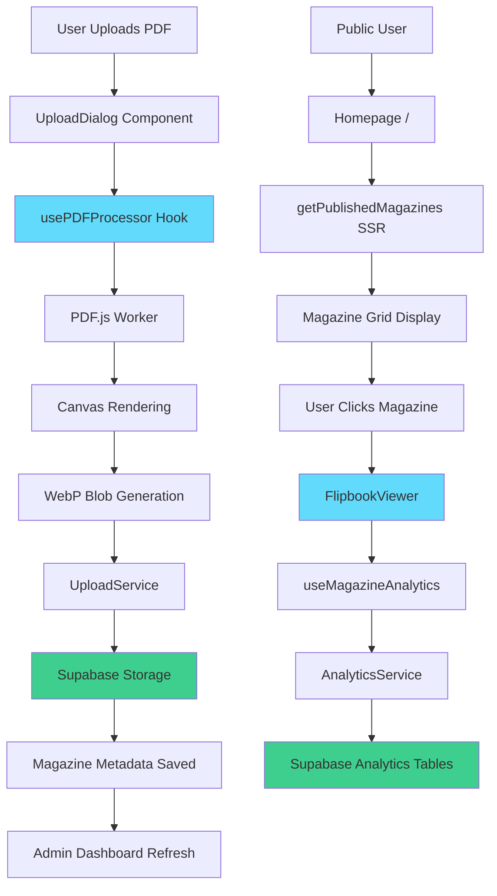

<div align="center">

# 📖 Balkon Dergisi

**Modern Digital Magazine Platform for Sezai Karakoç Anadolu Lisesi**

[](https://nextjs.org/)
[](https://react.dev/)
[](https://www.typescriptlang.org/)
[](https://supabase.com/)
[](./LICENSE)

[Features](#-features) • [Architecture](#-architecture) • [Getting Started](#-getting-started) • [Deployment](#-deployment) • [Analytics](#-analytics-dashboard)

</div>

---

## 🌟 Overview

**Balkon Dergisi** is a production-grade digital magazine platform that transforms PDF publications into immersive, interactive reading experiences. Built for **Sezai Karakoç Anadolu Lisesi**, it combines enterprise-level engineering with student publication accessibility.

This platform delivers:
- **📄 Intelligent PDF Processing** — Automated conversion with canvas-based high-fidelity rendering
- **📚 Realistic Flipbook Reader** — Page-turning animations with zoom, lock, and keyboard navigation
- **📊 Comprehensive Analytics** — Real-time session tracking with visualization dashboards
- **🔐 Secure Admin Portal** — Role-based authentication with magazine upload and management
- **⚡ Edge-Optimized Performance** — Static generation with ISR, compression, and security headers

---

## 🎯 Features

### 🎨 **Interactive Reader Experience**

Built on [`FlipbookViewer`](./src/components/FlipbookViewer.tsx), the reading interface delivers magazine-quality interactions:

- **Page Flip Animation** powered by [react-pageflip](https://github.com/Nodlik/StPageFlip) with smooth transitions
- **Zoom Controls** (1x → 4x scale) via [`ZoomContainer`](./src/components/reader/ZoomContainer.tsx) with pinch-to-zoom support
- **Page Lock Feature** prevents accidental navigation during zoomed reading
- **Keyboard Navigation** (Arrow keys) with accessibility aria-live announcements
- **Intelligent Preloading** — Adjacent pages prefetch for instant flips
- **Responsive Dimensions** using [`useResponsiveDimensions`](./src/hooks/useResponsiveDimensions.ts) for dynamic viewport scaling

### 🔄 **PDF Processing Pipeline**

The [`usePDFProcessor`](./src/hooks/usePDFProcessor.ts) hook encapsulates the entire transformation workflow:

1. **PDF Parsing** — [pdf.js](https://mozilla.github.io/pdf.js/) extracts vector pages with full fidelity
2. **Canvas Rendering** — High-resolution rasterization at configurable target heights (default: 2000px)
3. **WebP Conversion** — Efficient compression at 85% quality for optimal size/quality balance
4. **Progress Tracking** — Real-time page count with `processedPages` / `totalPages` state
5. **Memory Management** — Aggressive canvas cleanup and blob creation to prevent leaks

```typescript
const { processPDF, processedPages, totalPages, isProcessing, error } = usePDFProcessor()

const result = await processPDF(file, {
  targetHeight: 2000,
  quality: 0.85,
  onProgress: (current, total) => console.log(`Processing ${current}/${total}`)
})
// Returns: { pages: Blob[], totalPages: number }
```

### 📊 **Analytics & Insights**

Real-time analytics powered by [Supabase](https://supabase.com/) with [`AnalyticsService`](./src/lib/services/AnalyticsService.ts):

- **Session Tracking** — Device type, user agent, start time, duration
- **Event Buffering** — Batched writes (5 events or 10s interval) for performance
- **Graceful Degradation** — Fallback IDs when database is unavailable
- **Analytics Dashboard** at [`/admin/analytics`](./src/app/(admin)/admin/analytics) with:
  - 📈 Total sessions, unique users, average duration metrics
  - 📱 Device distribution (mobile/tablet/desktop) pie charts
  - 📆 Daily session trends via [Recharts](https://recharts.org/)

The [`useMagazineAnalytics`](./src/hooks/useMagazineAnalytics.ts) hook automatically tracks:
- Session initialization on magazine view
- Tab visibility changes (pause/resume events)
- Reader interactions (page turns tracked via event metadata)

### 🔐 **Authentication & Authorization**

Secure admin access via [Supabase Auth](https://supabase.com/docs/guides/auth) with SSR-compatible session management:

- **Middleware Protection** ([`middleware.ts`](./middleware.ts)) — Route guards for `/admin` paths
- **Auto-Refresh Sessions** — Proactive token renewal within 5 minutes of expiry
- **Role-Based Access** — Admin-only upload and magazine management
- **Password Management** — Secure change with current password verification
- **Error Recovery** — Graceful fallback redirects on auth failures

Authentication flow:
```
User → Login (/admin/login) → Middleware validates session → Admin dashboard (/admin/*)
                                      ↓ (no session)
                                Redirect to /admin/login
```

### 🚀 **Admin Management Portal**

Full-featured CMS at [`/admin`](./src/app/(admin)/admin) with:

- **Magazine Upload** via [`UploadDialog`](./src/app/(admin)/admin/UploadDialog.tsx):
  - Drag-and-drop PDF interface with file validation
  - Real-time processing progress with page-by-page status
  - Thumbnail preview generation
  - Idempotency tokens for safe retries
  
- **Magazine Table** ([`MagazineTable`](./src/app/(admin)/admin/MagazineTable.tsx)):
  - Sortable columns (title, issue, date, status)
  - Inline publish/unpublish toggles
  - Row actions (edit, delete, view)
  - Responsive mobile layout

- **Server Actions** ([`actions.ts`](./src/app/(admin)/admin/actions.ts)):
  - Type-safe mutations with Zod validation
  - Structured error handling via [`ErrorHandler`](./src/lib/errors/errorHandler.ts)
  - Transaction support for atomic operations

### 🛡️ **Security & Monitoring**

Enterprise-grade security layers:

- **CSP Headers** — Content Security Policy preventing XSS attacks
- **HTTP Security Headers**:
  - `X-Content-Type-Options: nosniff`
  - `X-Frame-Options: DENY`
  - `X-XSS-Protection: 1; mode=block`
  - `Referrer-Policy: strict-origin-when-cross-origin`
  
- **Sentry Integration** — Error tracking across client/server/edge with:
  - [`sentry.client.config.ts`](./sentry.client.config.ts) for frontend errors
  - [`sentry.server.config.ts`](./sentry.server.config.ts) for API routes
  - [`sentry.edge.config.ts`](./sentry.edge.config.ts) for middleware errors
  
- **Runtime Type Guards** — [`runtimeTypeGuards.ts`](./src/lib/guards/runtimeTypeGuards.ts) validate all external inputs

---

## 🏗️ Architecture

### Technology Stack

| Layer | Technology | Purpose |
|-------|-----------|---------|
| **Framework** | [Next.js 15.5](https://nextjs.org/) | App Router, Server Components, ISR, Server Actions |
| **UI Library** | [React 19.1](https://react.dev/) | Component architecture with latest concurrent features |
| **Language** | [TypeScript 5.x](https://www.typescriptlang.org/) | End-to-end type safety with strict mode |
| **Styling** | [Tailwind CSS 4](https://tailwindcss.com/) | Utility-first with custom PostCSS pipeline |
| **Component Library** | [Radix UI](https://www.radix-ui.com/) | Accessible primitives (Dialog, Dropdown, Select) |
| **Animations** | [Motion](https://motion.dev/) | Declarative animations for UI interactions |
| **Backend** | [Supabase](https://supabase.com/) | PostgreSQL database, Storage, Auth, Realtime |
| **PDF Engine** | [PDF.js](https://mozilla.github.io/pdf.js/) | Canvas-based rendering with worker support |
| **Charts** | [Recharts](https://recharts.org/) | Composable React charts for analytics |
| **Validation** | [Zod](https://zod.dev/) | Schema validation for forms and API inputs |
| **Forms** | [React Hook Form](https://react-hook-form.com/) | Performant forms with validation |
| **Monitoring** | [Sentry](https://sentry.io/) | Error tracking, performance monitoring |

### Project Structure

```
Balkon-Magazine/
├── src/
│   ├── app/                      # Next.js App Router
│   │   ├── (public)/            # Public routes (home, reader)
│   │   │   └── page.tsx         # Homepage with ISR (revalidate: 3600)
│   │   ├── (admin)/             # Protected admin routes
│   │   │   └── admin/
│   │   │       ├── page.tsx             # Admin dashboard
│   │   │       ├── analytics/           # Analytics dashboard
│   │   │       ├── login/               # Auth pages
│   │   │       ├── actions.ts           # Server Actions
│   │   │       └── UploadDialog.tsx     # Magazine upload UI
│   │   ├── layout.tsx           # Root layout with metadata
│   │   ├── error.tsx            # Global error boundary
│   │   └── not-found.tsx        # 404 page
│   │
│   ├── components/               # React components
│   │   ├── FlipbookViewer.tsx           # Main reader component
│   │   ├── reader/
│   │   │   └── ZoomContainer.tsx        # Zoom/pan logic
│   │   ├── ui/                          # Radix UI + shadcn components
│   │   ├── HomePage.tsx                 # Landing page
│   │   └── MagazineCard.tsx             # Magazine preview card
│   │
│   ├── hooks/                    # Custom React hooks
│   │   ├── usePDFProcessor.ts           # PDF → Images pipeline
│   │   ├── useMagazineAnalytics.ts      # Analytics tracking
│   │   ├── useFileUpload.ts             # Upload state management
│   │   └── useSupabaseClient.ts         # Client-side Supabase
│   │
│   ├── lib/                      # Core business logic
│   │   ├── services/                    # Service layer
│   │   │   ├── AnalyticsService.ts      # Analytics batching
│   │   │   ├── UploadService.ts         # File upload orchestration
│   │   │   ├── Logger.ts                # Structured logging
│   │   │   └── storage/                 # Storage abstraction
│   │   ├── repositories/                # Data access layer
│   │   │   └── SupabaseMagazineRepository.ts
│   │   ├── processors/                  # File processing
│   │   │   ├── PDFProcessor.ts          # PDF.js wrapper
│   │   │   └── ImageProcessor.ts        # Image optimization
│   │   ├── errors/                      # Error handling
│   │   │   ├── GlobalErrorHandler.ts    # Centralized error mgmt
│   │   │   └── errorHandler.ts          # Error normalization
│   │   ├── guards/                      # Runtime type validation
│   │   │   └── runtimeTypeGuards.ts     # Type guard utilities
│   │   ├── config/                      # Configuration
│   │   │   ├── env.ts                   # Validated env vars
│   │   │   └── app-config.ts            # App constants
│   │   ├── supabase/                    # Supabase clients
│   │   │   ├── client.ts                # Browser client
│   │   │   └── server.ts                # Server-side client
│   │   └── utils/                       # Utilities
│   │       └── asyncPatterns.ts         # Promise wrappers
│   │
│   └── types/                    # TypeScript definitions
│       ├── magazine.ts                  # Magazine domain types
│       └── pdfjs.ts                     # PDF.js type extensions
│
├── middleware.ts                 # Auth middleware
├── next.config.ts                # Next.js configuration
├── tailwind.config.ts            # Tailwind configuration
├── tsconfig.json                 # TypeScript configuration
├── components.json               # shadcn/ui configuration
├── sentry.*.config.ts            # Sentry configurations
└── package.json                  # Dependencies
```

### Data Flow



### Database Schema

Supabase PostgreSQL tables:

**`magazines`**
```sql
- id: uuid (PK)
- title: text
- issue_number: integer
- issue_date: date
- description: text
- cover_image_url: text
- page_image_urls: text[] -- Array of Supabase Storage URLs
- status: enum('draft', 'published')
- created_at: timestamp
- updated_at: timestamp
```

**`analytics_sessions`**
```sql
- id: uuid (PK)
- magazine_id: uuid (FK → magazines)
- device_type: enum('mobile', 'tablet', 'desktop')
- user_agent: text
- started_at: timestamp
- last_active_at: timestamp
```

**`analytics_events`**
```sql
- id: uuid (PK)
- session_id: uuid (FK → analytics_sessions)
- event_type: enum('interaction')
- metadata: jsonb
- created_at: timestamp
```

---

## 🚀 Getting Started

### Prerequisites

- **Node.js** ≥ 18.0.0
- **npm** ≥ 8.0.0
- **Supabase Account** — [Create free project](https://supabase.com/dashboard)

### Installation

1. **Clone the repository**
   ```bash
   git clone https://github.com/Woffluon/Balkon-Magazine.git
   cd Balkon-Magazine
   ```

2. **Install dependencies**
   ```bash
   npm install
   ```

3. **Configure environment variables**
   
   Create `.env.local` from template:
   ```bash
   cp .env.example .env.local
   ```
   
   Update with your Supabase credentials:
   ```env
   NEXT_PUBLIC_SUPABASE_URL=https://your-project.supabase.co
   NEXT_PUBLIC_SUPABASE_ANON_KEY=your-anon-key
   NEXT_PUBLIC_SITE_URL=http://localhost:3000
   ```

4. **Set up Supabase**
   
   Execute the database migrations in your Supabase SQL editor (found in [`src/migration`](./src/migration/) if available, or manually create tables per schema above).
   
   Configure Storage bucket:
   - Bucket name: `magazines`
   - Public access: **Enabled** (for image serving)
   - File size limit: **500MB** (for PDFs)

5. **Run development server**
   ```bash
   npm run dev
   ```
   
   Open [http://localhost:3000](http://localhost:3000)

### Development Commands

```bash
# Development with Turbopack
npm run dev

# Production build
npm run build

# Start production server
npm start

# Type checking
npm run type-check

# Linting
npm run lint

# Clean build artifacts
npm run clean
```

---

## 📦 Deployment

### Vercel (Recommended)

This project is optimized for [Vercel](https://vercel.com/) deployment:

1. **Connect repository** to Vercel dashboard
2. **Set environment variables** in Vercel project settings:
   ```
   NEXT_PUBLIC_SUPABASE_URL
   NEXT_PUBLIC_SUPABASE_ANON_KEY
   NEXT_PUBLIC_SITE_URL (your production URL)
   SENTRY_DSN (optional, for error tracking)
   NEXT_PUBLIC_SENTRY_DSN (optional)
   ```

3. **Deploy** — Vercel auto-detects Next.js configuration

#### Build Configuration

The production build uses:
- **Output**: `standalone` (optimized Node.js server)
- **Image Optimization**: Disabled (`unoptimized: true`) for static hosting compatibility
- **Server Actions**: 500MB body size limit for PDF uploads
- **Compression**: Enabled via `compress: true`

### Self-Hosting

For non-Vercel deployments:

```bash
npm run build
npm start
```

Ensure your hosting environment supports:
- Node.js 18+
- Environment variable injection
- Persistent storage for `.next` cache (optional)

### PDF.js Worker Setup

The `postinstall` script automatically copies `pdf.worker.min.mjs` to `public/`:
```bash
node -e "require('fs').copyFileSync('node_modules/pdfjs-dist/build/pdf.worker.min.mjs', 'public/pdf.worker.min.mjs')"
```

Verify the worker is accessible at `/pdf.worker.min.mjs` after deployment.

---

## 📊 Analytics Dashboard

Access magazine insights at `/admin/analytics`:

### Available Metrics

- **Overview Cards**
  - Total sessions across all magazines
  - Unique users (distinct device fingerprints)
  - Average session duration

- **Device Distribution**
  - Pie chart breakdown (mobile/tablet/desktop)
  - Percentage analysis

- **Engagement Trends**
  - Daily session counts
  - Line chart with date range filters

### Implementation Details

The analytics system uses:
- **Batched Writes** — Events buffer to 5 items or 10s, whichever comes first
- **Retry Logic** — Failed flushes re-queue (max 100 pending)
- **Graceful Degradation** — Fallback UUIDs if database unavailable
- **Last Active Tracking** — Updated on every event flush

Data flows through:
```
React Component → useMagazineAnalytics → AnalyticsService → Supabase Tables
```

---

## 🔧 Configuration

### Key Files

**[`next.config.ts`](./next.config.ts)**
- Image domains for Supabase CDN
- CSP headers securing external resources
- Webpack warnings suppression (OpenTelemetry)

**[`APP_CONFIG`](./src/lib/config/app-config.ts)**
```typescript
export const APP_CONFIG = {
  magazine: {
    aspectRatio: { width: 16, height: 9 },
    preload: { pagesAhead: 3 },
    viewport: { loadingHeight: 600 }
  },
  system: {
    performance: { maxExecutionTime: 30000 }
  }
}
```

**[`PDF_CONFIG`](./src/lib/constants/upload.ts)**
```typescript
export const PDF_CONFIG = {
  WORKER_SRC: '/pdf.worker.min.mjs',
  TARGET_HEIGHT: 2000,
  CONTEXT_TYPE: '2d' as const
}

export const IMAGE_CONFIG = {
  FORMAT: 'image/webp',
  WEBP_QUALITY: 0.85
}
```

### Environment Variables

| Variable | Description | Required |
|----------|-------------|----------|
| `NEXT_PUBLIC_SUPABASE_URL` | Supabase project URL | ✅ |
| `NEXT_PUBLIC_SUPABASE_ANON_KEY` | Supabase anonymous key | ✅ |
| `NEXT_PUBLIC_SITE_URL` | Canonical site URL | ✅ |
| `NEXT_PUBLIC_PDFJS_WORKER_URL` | PDF.js worker path | ❌ (default: `/pdf.worker.min.mjs`) |
| `SENTRY_DSN` | Sentry error tracking DSN | ❌ |
| `NEXT_PUBLIC_SENTRY_DSN` | Client-side Sentry DSN | ❌ |

All environment validation is handled by [`env.ts`](./src/lib/config/env.ts) using Zod schemas.

---

## 🤝 Contributing

We welcome contributions! Here's how to get started:

1. **Fork** the repository
2. **Create a feature branch** (`git checkout -b feature/amazing-feature`)
3. **Commit changes** (`git commit -m 'Add amazing feature'`)
4. **Push to branch** (`git push origin feature/amazing-feature`)
5. **Open a Pull Request**

### Code Standards

- **TypeScript Strict Mode** — All code must pass `npm run type-check`
- **ESLint** — Follow Next.js recommended config
- **Component Structure** — Keep components under 300 lines
- **Error Handling** — Use structured error patterns from [`ErrorHandler`](./src/lib/errors/errorHandler.ts)
- **Logging** — Use [`Logger`](./src/lib/services/Logger.ts) instead of `console.log`

---

## 📄 License

This project is licensed under the **MIT License** — see the [`LICENSE`](./LICENSE) file for details.

Copyright © 2025 Efe Arabacı

---

## 🙋 Support

For questions or issues:

- **GitHub Issues** — [Report bugs or request features](https://github.com/Woffluon/Balkon-Magazine/issues)
- **Documentation** — Comprehensive inline comments in source code
- **Supabase Docs** — [Database and Auth guides](https://supabase.com/docs)
- **Next.js Docs** — [Framework reference](https://nextjs.org/docs)

---

<div align="center">

**Built with ❤️ for Sezai Karakoç Anadolu Lisesi**

[Report Bug](https://github.com/Woffluon/Balkon-Magazine/issues) • [Request Feature](https://github.com/Woffluon/Balkon-Magazine/issues)

</div>
